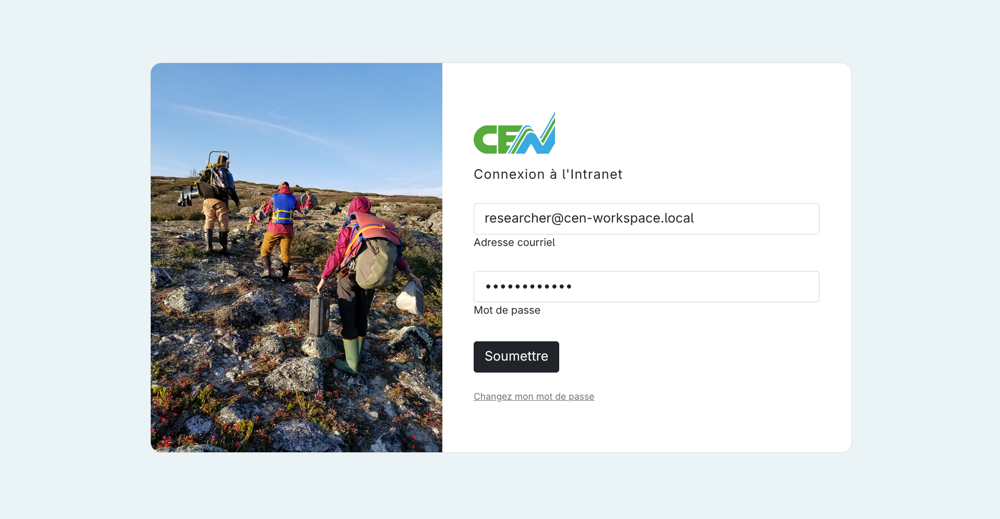
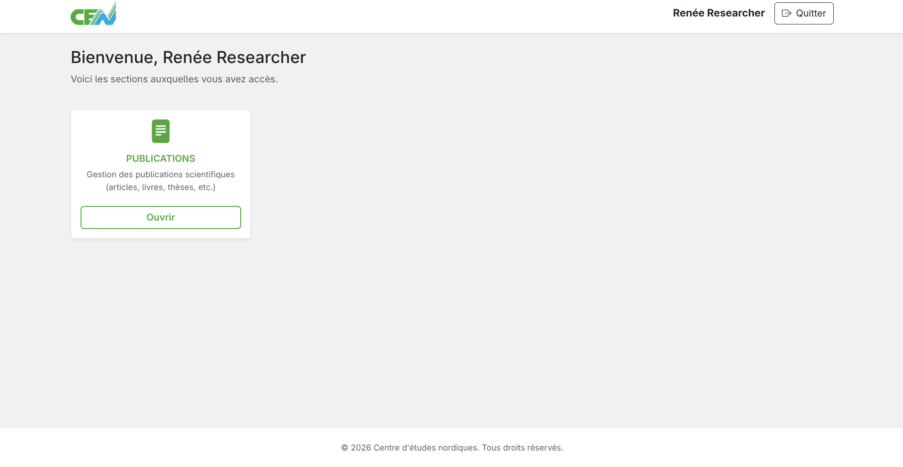
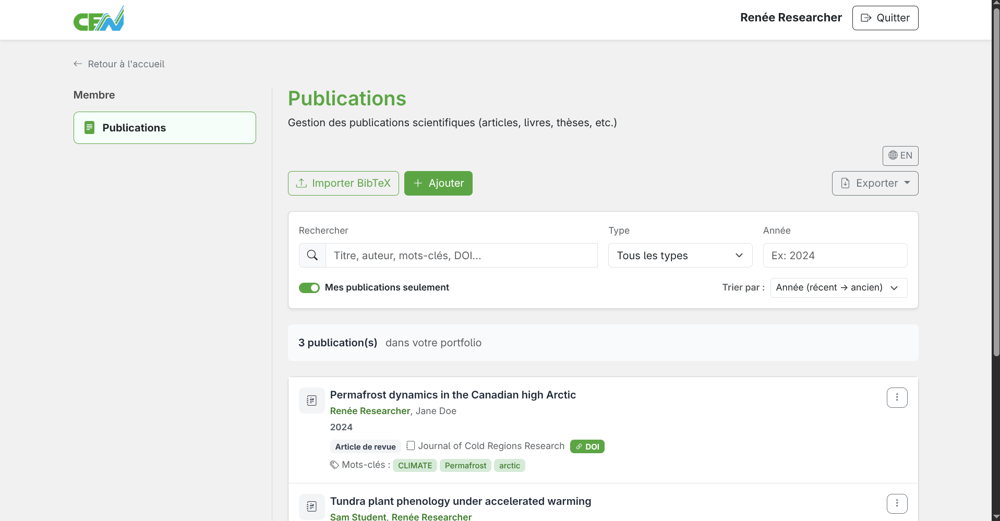

# Accessing the Publications Module

## Logging in to the intranet

To access the publications module, you must first log in to the CEN intranet with your email address and password.

<figure markdown>
  
  <figcaption>CEN intranet login page</figcaption>
</figure>

## Navigating to the module

Once logged in, find the publications module card. Click **Open** to open the module.

<figure markdown>
  
  <figcaption>Main menu — click "Open"</figcaption>
</figure>

## Publications module home page

You will land on the main page of the publications module. From here you can manage all your publications: browse, add, edit, import, or export them.

<figure markdown>
  
  <figcaption>Publications module home page</figcaption>
</figure>

---

**Next step:** [Create and edit publications →](create-edit.md)
