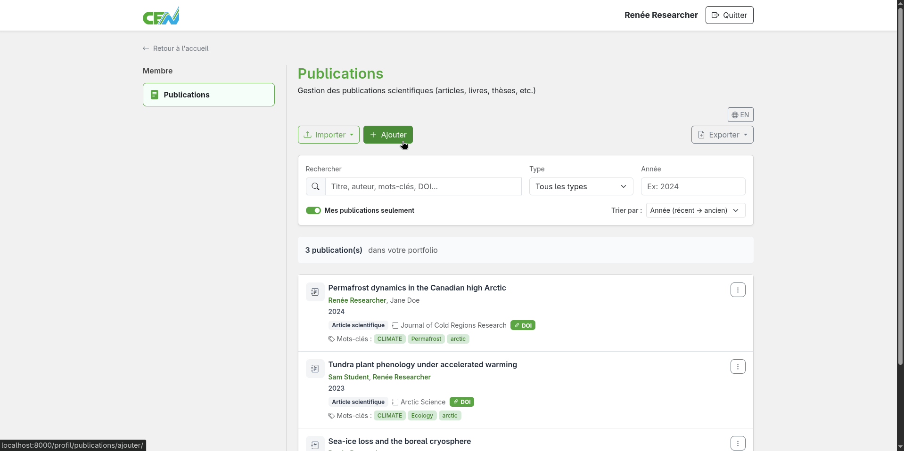
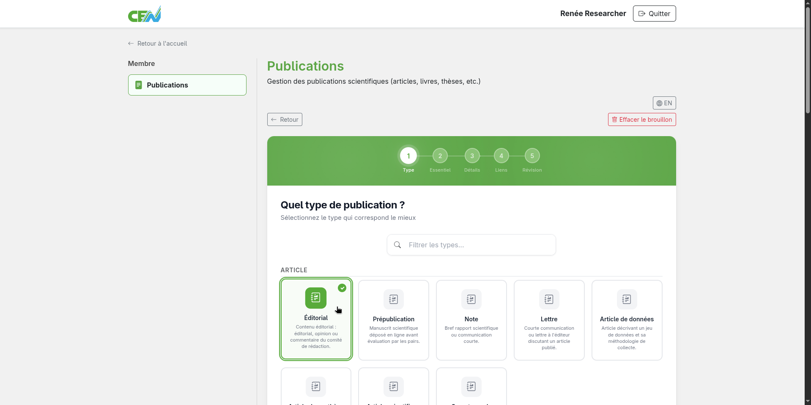
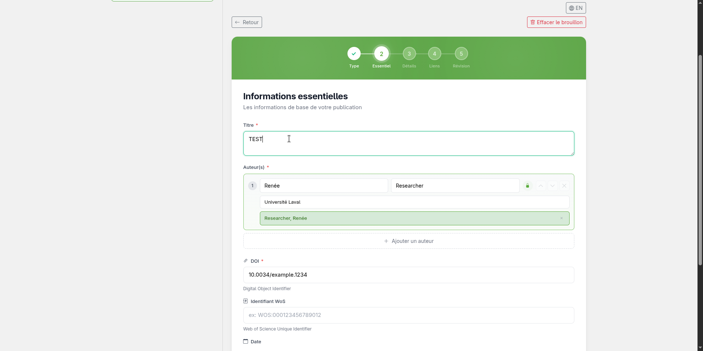
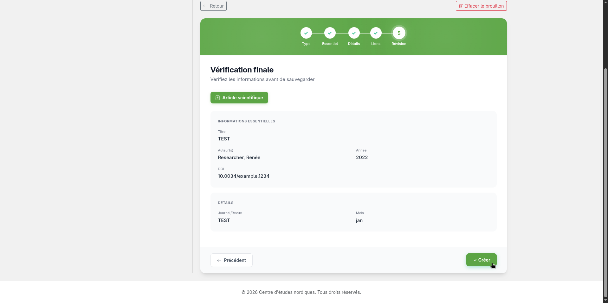

# Creating a Publication

You can add a new publication manually directly in the publications module.

## Accessing the creation form

From the module home page, click the **Add** button.

<figure markdown>
  
  <figcaption>Click "Add"</figcaption>
</figure>

## Filling in the form

Fill in the fields of each step of the form with the publication's information. Required fields are marked with an asterisk (*).

<figure markdown>
  
  <figcaption>Publication creation form</figcaption>
</figure>

<figure markdown>
  
  <figcaption>Publication creation form (continued)</figcaption>
</figure>

## Saving the publication

Once the form is complete, click **Create** to add the publication to the catalogue.

<figure markdown>
  
  <figcaption>Click "Create" to confirm the creation</figcaption>
</figure>

---

**Next step:** [Edit a publication →](edit.md)
