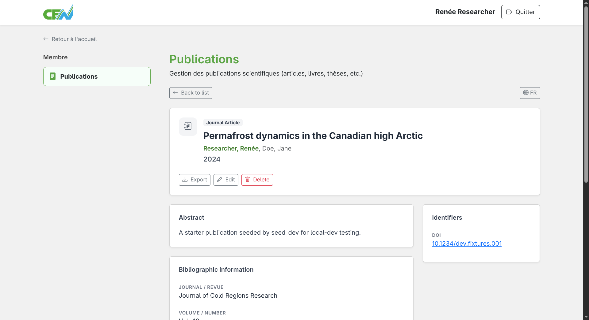
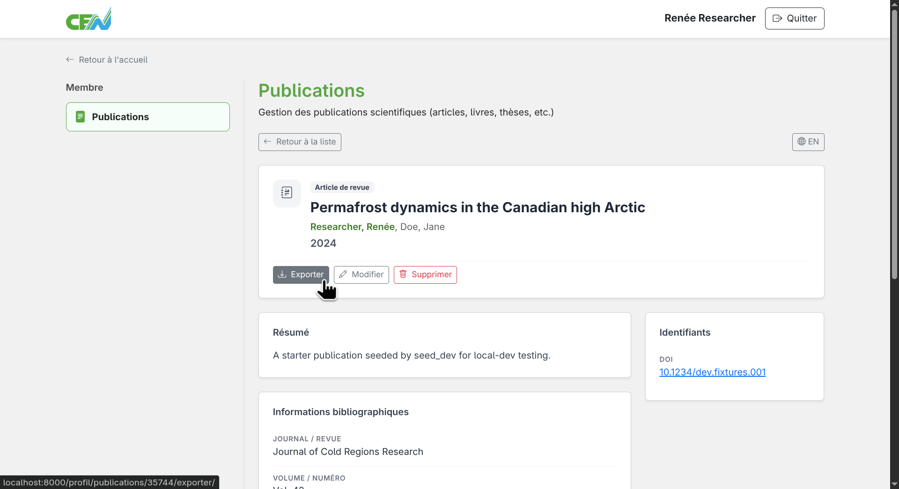
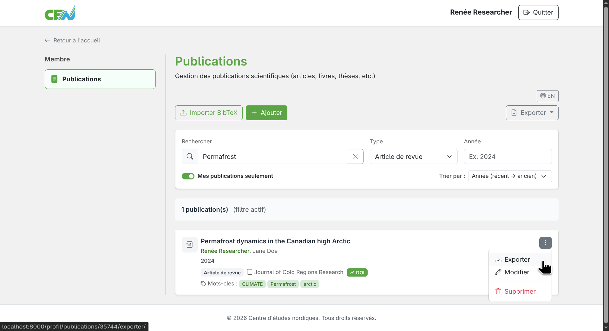
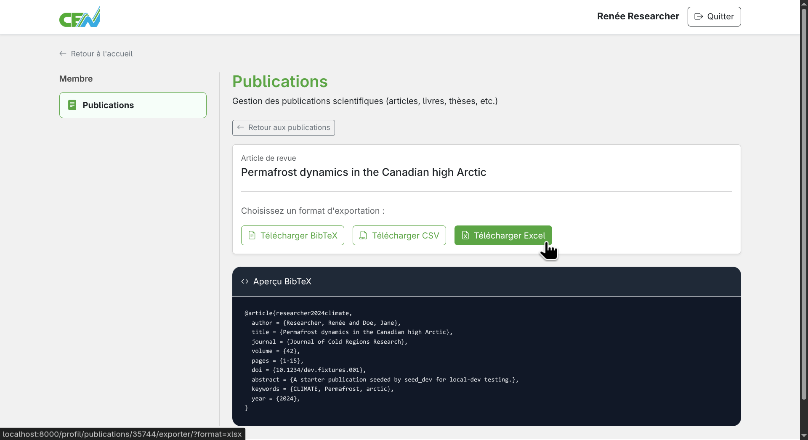
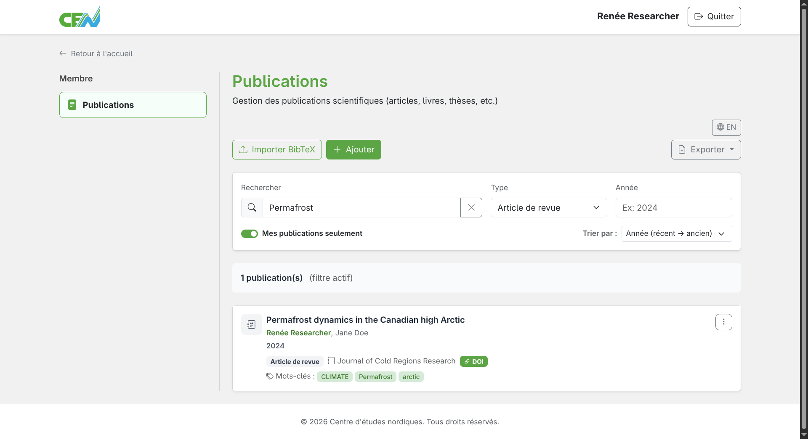
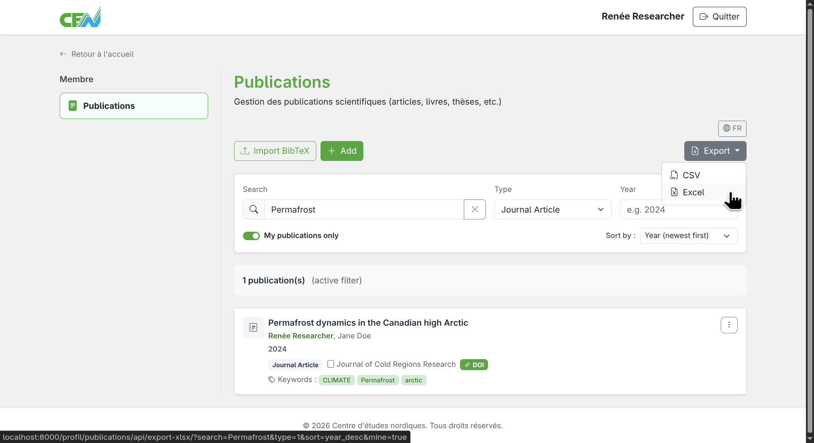

# Exporting Publications

The publications module lets you export your publications in three formats: **CSV**, **BibTeX**, and **Excel (XLSX)**.

---

## Export a single publication

To export an individual publication, start by opening its detail record by clicking on its title in the list.

<figure markdown>
  
  <figcaption>Open a publication's record by clicking its title</figcaption>
</figure>

On the record page, locate the "Export" button and click it. You will be redirected to the publication's export page.

<figure markdown>
  
  <figcaption>Click the "Export" button</figcaption>
</figure>

You can also reach the export page directly from the list by clicking the publication's menu and selecting "Export".

<figure markdown>
  
  <figcaption>Click "Export" from the list menu</figcaption>
</figure>

Then choose your desired format:

- **CSV** — structured text file, compatible with Excel and most spreadsheet applications
- **BibTeX** — standard format for reference managers (Zotero, Mendeley, etc.)
- **Excel (XLSX)** — Microsoft Excel spreadsheet file

<figure markdown>
  
  <figcaption>Select your desired export format</figcaption>
</figure>

A save dialog will open, letting you choose where to save the file.

---

## Export multiple publications

To export a set of publications, use the module's main list. You can apply filters first to narrow down the publications you want to export, or leave the list unfiltered to export all of your publications.

<figure markdown>
  
  <figcaption>Apply filters if needed before exporting</figcaption>
</figure>

Then locate the export menu at the top of the list and choose your desired format:

- **CSV** — structured text file, compatible with Excel and most spreadsheet applications
- **Excel (XLSX)** — Microsoft Excel spreadsheet file

<figure markdown>
  
  <figcaption>Select the export format for all displayed publications</figcaption>
</figure>

A save dialog will open, letting you choose where to save the file. The exported file will contain all publications matching the active filters at the time of export.

---

**Next step:** [Hide a publication →](hide.md)
