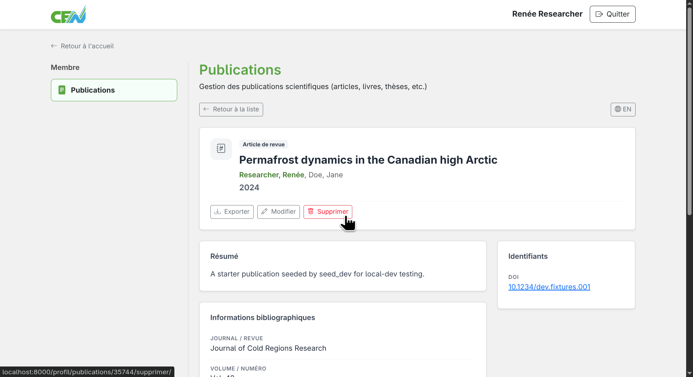
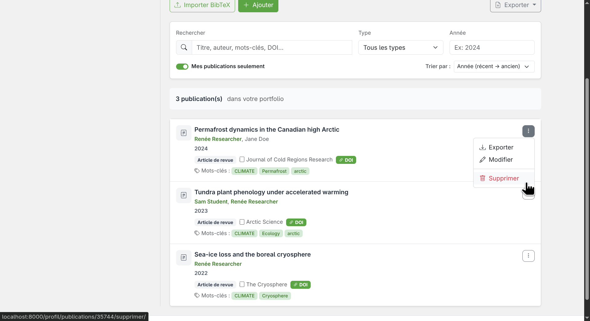
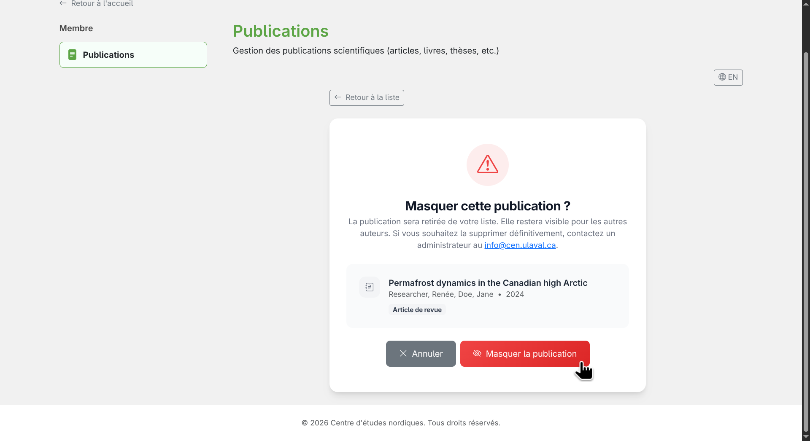

# Masquer une publication

Il est possible de masquer une publication pour qu'elle n'apparaisse plus dans votre liste personnelle. À noter que la publication n'est pas supprimée, mais seulement masquée de liste. Elle restera visible dans le catalogue du CEN. Si votre intention est bel et bien de supprimer la publication, contactez un administrateur qui pourra le faire pour vous.

## Accéder à l'option de masquage

Il existe deux façons de masquer une publication.

**Depuis la fiche de la publication** — ouvrez la fiche détaillée en cliquant sur le titre de la publication, puis cliquez sur le bouton **Supprimer**.

<figure markdown>
  
  <figcaption>Cliquez sur "Supprimer" depuis la fiche de la publication</figcaption>
</figure>

**Depuis la liste** — cliquez sur le menu de la publication dans la liste, puis sélectionnez **Supprimer**.

<figure markdown>
  
  <figcaption>Cliquez sur "Supprimer" depuis le menu de la liste</figcaption>
</figure>

## Confirmer le masquage

Vous serez redirigés vers une page de confirmation. Cliquez sur **Masquer la publication** pour masquer la publication ou sur **Annuler** pour annuler le masquage.

<figure markdown>
  
  <figcaption>Confirmez le masquage de la publication</figcaption>
</figure>

Une fois masquée, la publication n'apparaîtra plus dans votre liste personnelle, mais restera visible dans le catalogue du CEN.

## Rendre une publication visible à nouveau

Pour rendre une publication masquée à nouveau visible dans votre liste, contactez un administrateur qui le fera pour vous.
