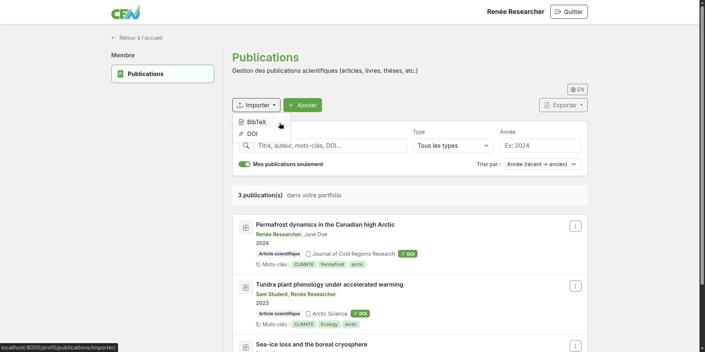
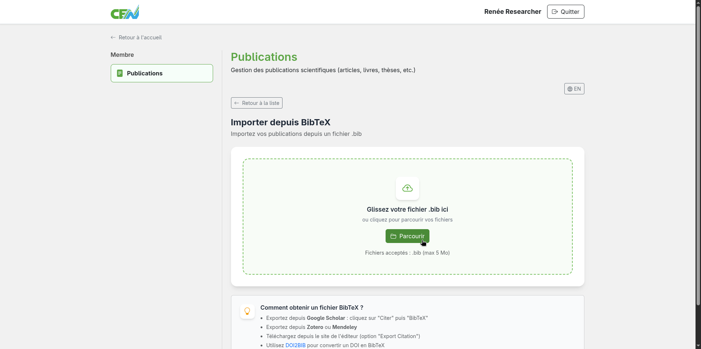
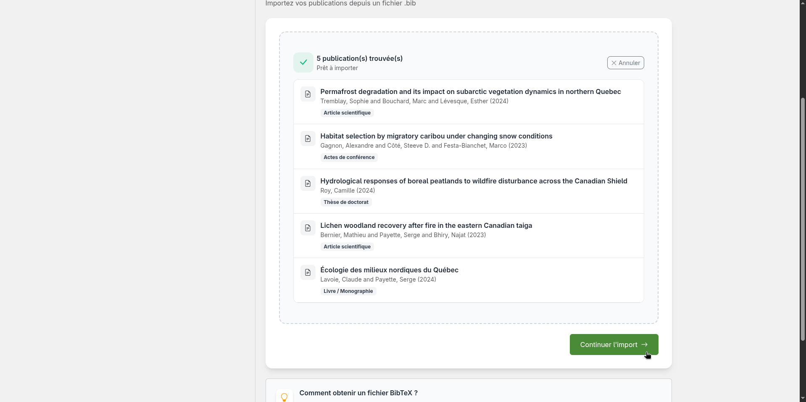
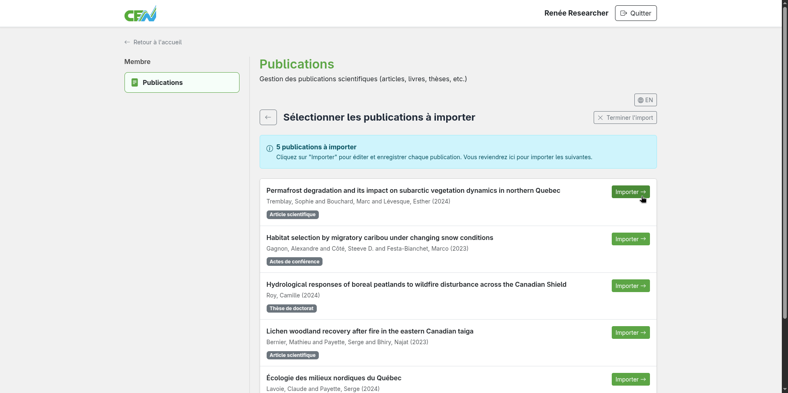
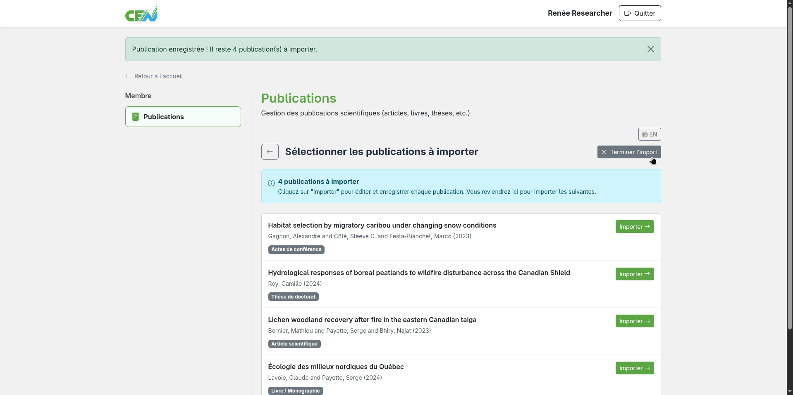

# Importer depuis un fichier BibTeX

Le module de publications vous permet d'importer un lot de publications en téléversant un fichier BibTeX (`.bib`). Ce format est exporté par la plupart des gestionnaires bibliographiques tels que Zotero, Mendeley ou EndNote.

## Exporter un fichier BibTeX depuis votre gestionnaire

Avant d'importer, exportez vos publications au format BibTeX depuis votre gestionnaire bibliographique. Consultez la documentation de votre logiciel pour connaître la procédure d'export.

## Accéder à l'import BibTeX

Depuis la page d'accueil du module, repérez le menu **Importer**, puis sélectionnez l'option **BibTeX**.

<figure markdown>
  
  <figcaption>Sélectionnez "BibTeX"</figcaption>
</figure>

## Téléverser le fichier

Cliquez sur le bouton de sélection de fichier et choisissez votre fichier `.bib` depuis votre ordinateur ou glissez le fichier dans la zone de dépôt.

<figure markdown>
  
  <figcaption>Sélectionnez votre fichier .bib</figcaption>
</figure>

## Vérifier les publications importées

Le module analyse le fichier et affiche la liste des publications détectées. Les publications déjà présentes dans votre liste seront signalées et ignorées pour éviter les doublons. Cliquez sur **Continuer l'import**.

<figure markdown>
  
  <figcaption>Liste des publications détectées dans le fichier BibTeX</figcaption>
</figure>

## Importer les publications une à une

Repérez la publication à importer, puis cliquez sur **Importer**.

<figure markdown>
  
  <figcaption>Importez les publications une à une</figcaption>
</figure>

## Validation des entrées

Vous serez alors redirigés vers la page de création préremplie. Vérifiez chaque champ, complétez les informations manquantes si nécessaire, puis cliquez sur **Créer** pour ajouter la publication à votre liste. Vous serez ensuite redirigés vers la page d'import. Répétez ces deux étape pour chaque publication à importer.

<figure markdown>
  
  <figcaption>Validez chaque entrée et cliquez sur "Créer"</figcaption>
</figure>

## Terminer l'import

Lorsque toutes les publications du fichier ont été importées, vous serez automatiquement redirigés vers la page d'accueil du module. Pour terminer l'import manuellement, cliquez sur **Terminer l'import**.

<figure markdown>
  
  <figcaption>Cliquez sur "Terminer l'import"</figcaption>
</figure>

---

**Prochaine étape :** [Importer depuis ORCID →](import-orcid.md)
