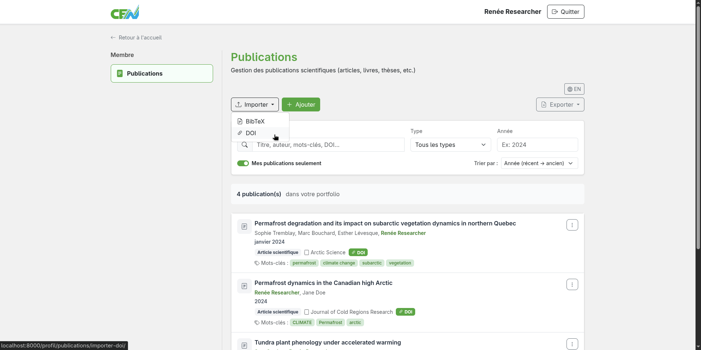
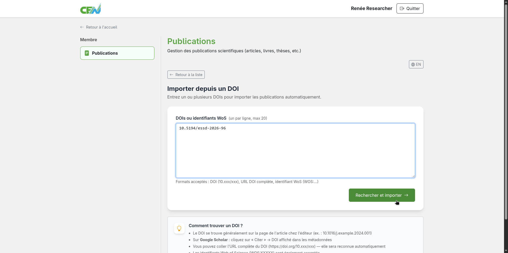
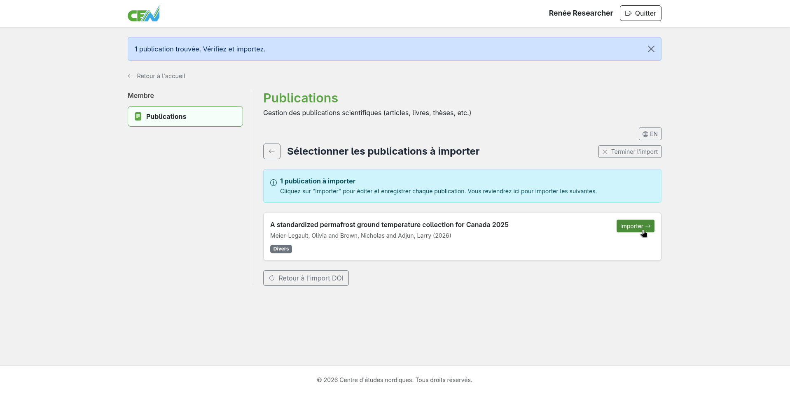
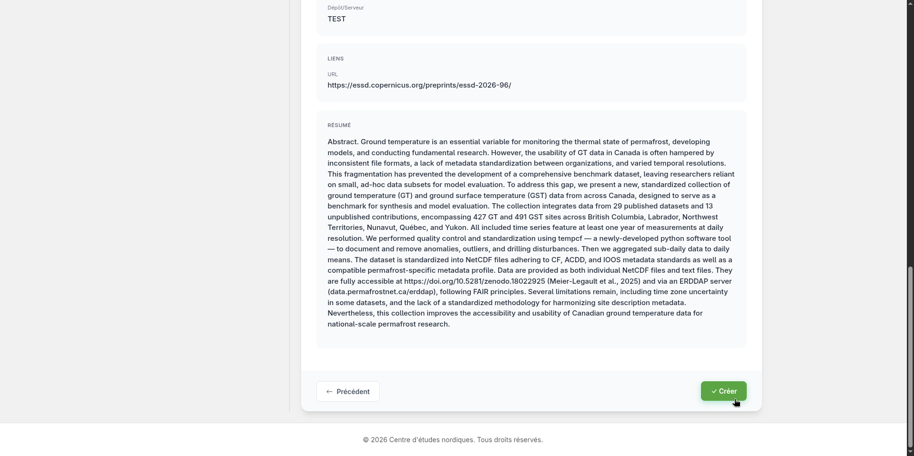
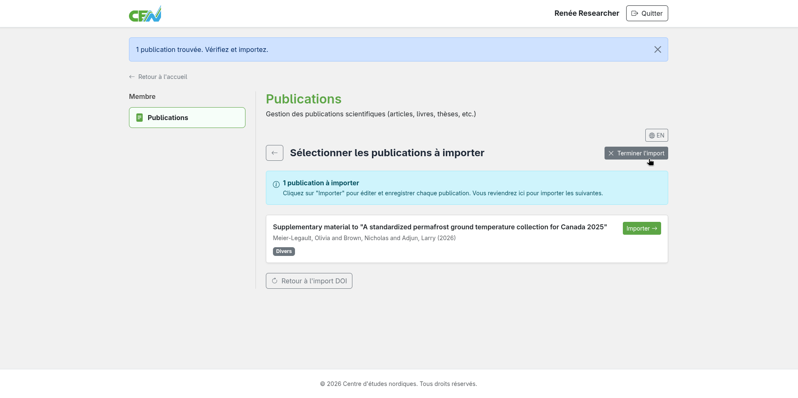

# Import from a DOI

The publications module lets you quickly add one or more publications by entering a DOI (Digital Object Identifier) or a WoS ID (Web of Science Identifier). Metadata is retrieved automatically from bibliographic databases.

## Accessing the DOI import

From the module home page, locate the **Import** menu, then select the **DOI** option.

<figure markdown>
  
  <figcaption>Select "DOI"</figcaption>
</figure>

## Entering the DOI(s)

Type the DOI or WoS ID of the publication into the input field, then click **Search and import**. To import multiple publications, enter each identifier on a separate line.

**Accepted formats:**

- `10.1234/example.2024`
- `WOS:000123456789012`

<figure markdown>
  
  <figcaption>Enter the DOI or WoS ID of the publication</figcaption>
</figure>

## Reviewing the detected publications

The module searches for publications matching the entered identifiers and displays the list of results. Publications already in your list will be flagged and skipped to avoid duplicates.

<figure markdown>
  
  <figcaption>List of retrieved publications</figcaption>
</figure>

## Importing publications one by one

Locate the publication you want to import, then click **Import**.

<figure markdown>
  
  <figcaption>Import publications one by one</figcaption>
</figure>

## Validating entries

You will be redirected to the pre-filled creation page with the retrieved metadata. Review each field, fill in any missing information if needed, then click **Create** to add the publication to your list. You will then be redirected back to the import page. Repeat these two steps for each publication to import.

<figure markdown>
  
  <figcaption>Validate the entry and click "Create"</figcaption>
</figure>

## Finishing the import

When all publications have been imported, you will be automatically redirected to the module home page. To finish the import manually, click **Finish import**.

<figure markdown>
  
  <figcaption>Click "Finish import"</figcaption>
</figure>

---

**Next step:** [Search publications →](search.md)
