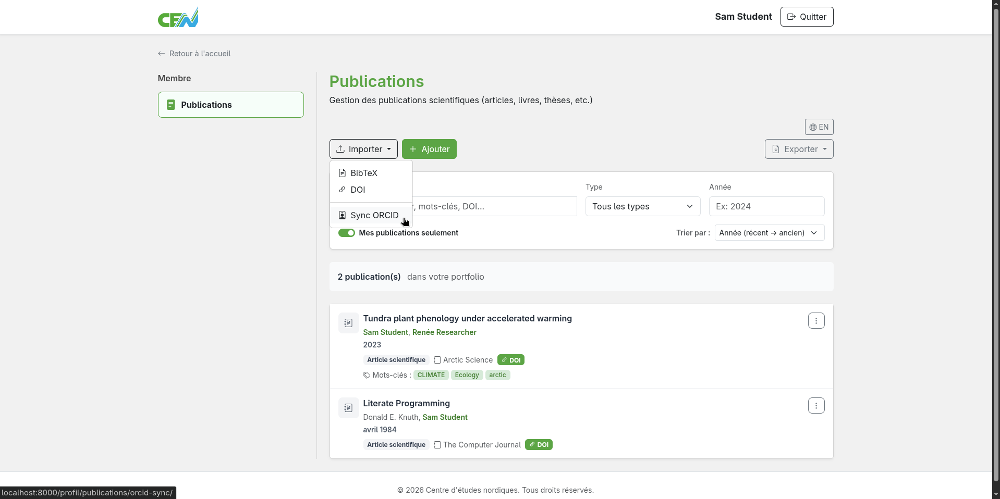
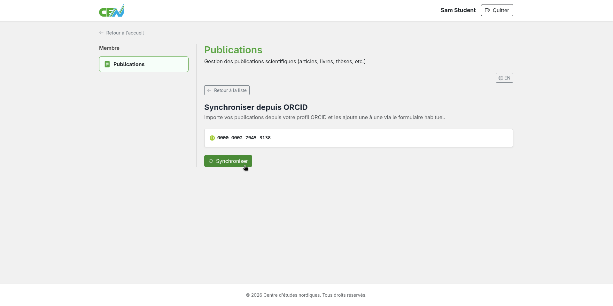
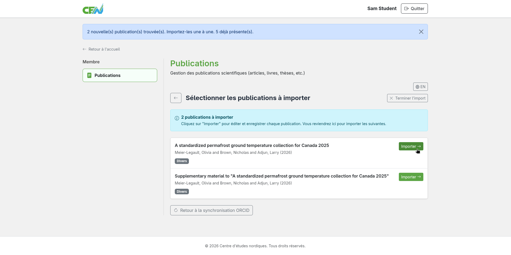
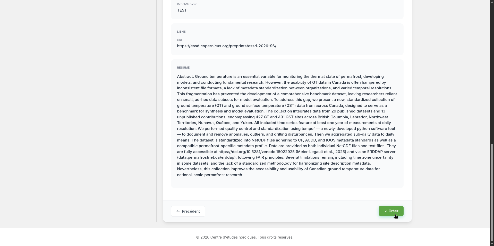
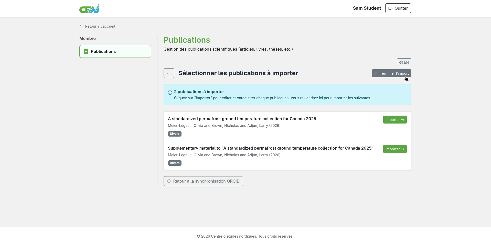

# Import from ORCID

The publications module lets you import your publications directly from your ORCID profile. Your ORCID identifier (format `0000-0000-0000-0000`) must be linked to your user account. If it is not, contact an administrator.

## Accessing the ORCID import

From the module home page, locate the **Import** menu, then select the **Sync ORCID** option.

<figure markdown>
  
  <figcaption>Select "Sync ORCID"</figcaption>
</figure>

## Validating your ORCID identifier

Confirm the ORCID identifier displayed, then click **Synchronize**.

<figure markdown>
  
  <figcaption>Click "Synchronize"</figcaption>
</figure>

## Reviewing the publications found

The module retrieves the publications associated with your ORCID profile and displays them as a list. Publications already in your list are flagged to avoid duplicates.

<figure markdown>
  
  <figcaption>Publications found on your ORCID profile</figcaption>
</figure>

## Importing publications one by one

Locate the publication you want to import, then click **Import**.

<figure markdown>
  
  <figcaption>Import publications one by one</figcaption>
</figure>

## Validating entries

You will be redirected to the pre-filled creation page. Review each field, fill in any missing information if needed, then click **Create** to add the publication to your list. You will then be redirected back to the import page. Repeat these two steps for each publication to import.

<figure markdown>
  
  <figcaption>Validate each entry and click "Create"</figcaption>
</figure>

## Finishing the import

When all publications have been created, you will be automatically redirected to the module home page. To finish the import manually, click **Finish import**.

<figure markdown>
  
  <figcaption>Click "Finish import"</figcaption>
</figure>

---

**Next step:** [Import from a DOI →](import-doi.md)
