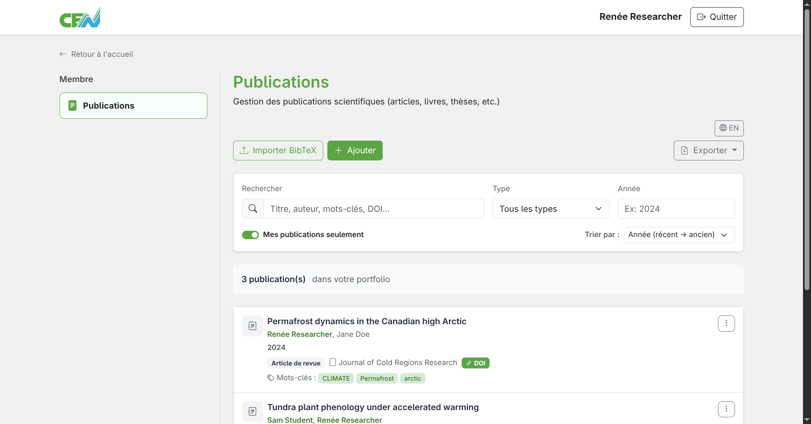
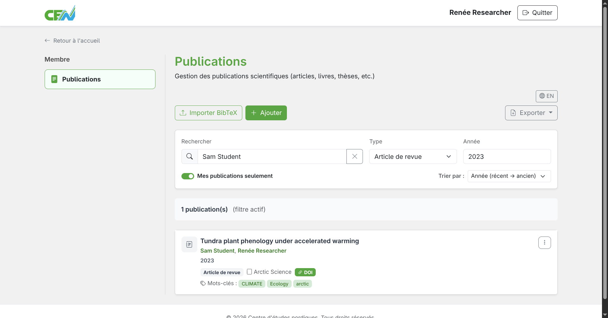
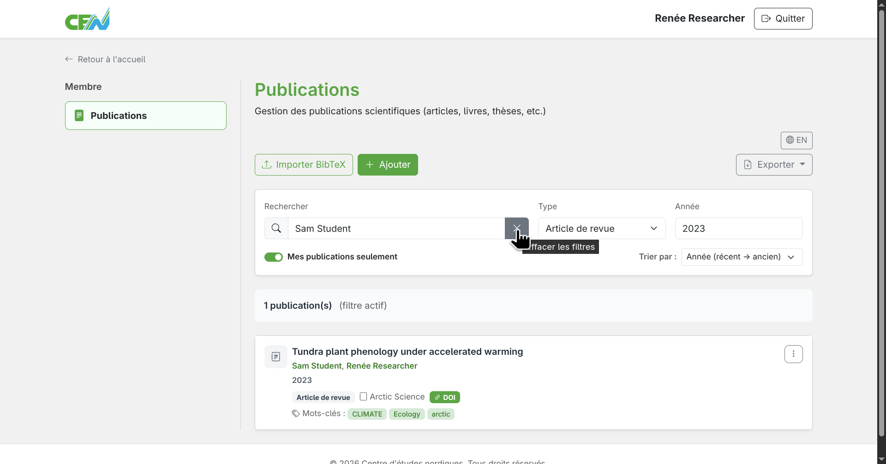
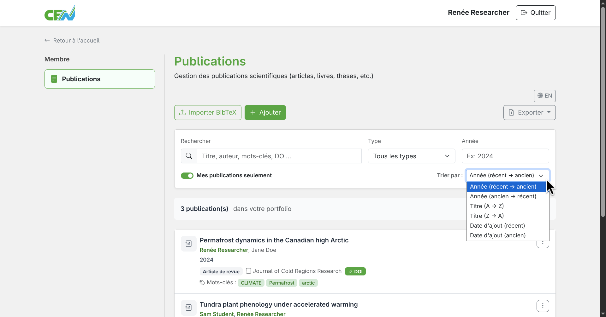
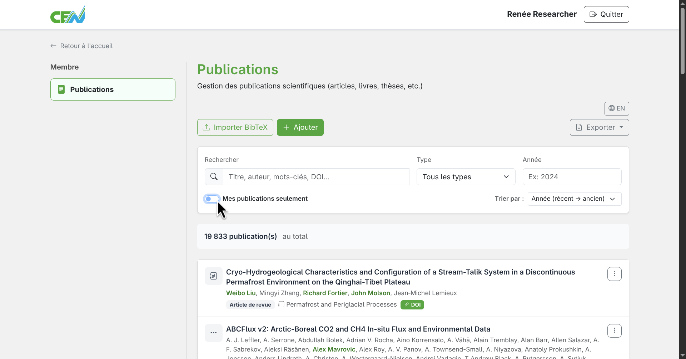
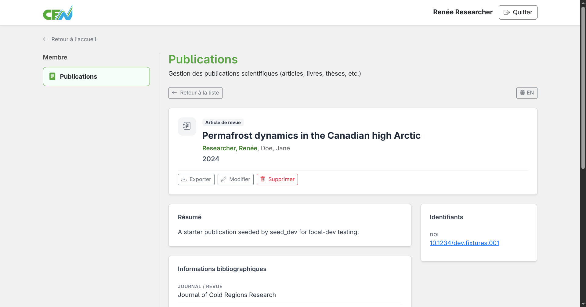

# Rechercher des publications

Le module de publications vous permet de consulter et de filtrer vos publications ainsi que l'ensemble des publications des membres du CEN.

## Accéder à la liste des publications

Depuis la page d'accueil du module, les publications sont affichées sous forme de liste. Vous pouvez parcourir cette liste ou utiliser les outils de filtrage pour affiner votre recherche.

<figure markdown>
  
  <figcaption>Liste des publications des membres</figcaption>
</figure>

## Filtrer et rechercher les publications

Plusieurs filtres sont disponibles pour affiner les résultats :

- **Titre** — filtrer par titre
- **Auteur** — filtrer par nom d'auteur
- **Mots-clés** — filtrer par mots-clés
- **Discipline** — filtrer par discipline
- **Site d'étude** — filtrer par site d'étude
- **DOI** — rechercher par DOI
- **WoS ID** — rechercher par identifiant Web of Science
- **Journal** — filtrer par journal
- **URL** — rechercher par URL
- **Année** — limiter les résultats à une année de publication
- **Type de publication** — article, livre, chapitre, conférence, etc.

Utilisez la barre de recherche, la liste déroulante des types et le champ "année" pour filtrer les publications. La barre de recherche permet de filtrer plusieurs champs à la fois, il suffit de les taper un à la suite de l'autre. Par exemple, taper "John Doe Biologie" affichera les publications dont John Doe est un auteur et dont la biologie est une de ses disciplines.

<figure markdown>
  
  <figcaption>Boite de rechercher et de filtrage des publications</figcaption>
</figure>

## Effacer les filtres

Pour retirer les filtres, repérez le X situé à l'extrémité gauche de la barre de recherche lorsqu'un filtre est actif. Cliquez sur le bouton pour effacer les filtres.

<figure markdown>
  
  <figcaption>Cliquez sur le X pour effacer les filtres</figcaption>
</figure>

## Trier les résultats

Pour trier les résultats du filtrage, repérez la liste déroulante "Trier par" sous le champ "année".

Plusieurs options de triage sont disponibles:

- **Année (récent → ancien)** — Trier par année de publication, du plus récent au plus ancien
- **Année (ancien → récent)** — Trier par année de publication, du plus ancien au plus récent
- **Titre (A → Z)** — Trier par titre, en ordre alphabétique
- **Titre (Z → A)** — Trier par titre, en ordre alphabétique inversé
- **Date d'ajout (récent)** — Trier par date d'ajout, du plus récent au plus ancien
- **Date d'ajout (ancien)** — Trier par date d'ajout, du plus ancien au plus récent

<figure markdown>
  
  <figcaption>Liste déroulante des options de triage</figcaption>
</figure>

## Afficher toutes les publications

Par défaut, la liste des publications affiche seulement vos publications. Il est tout de même possible de consulter toutes les publications du catalogue du CEN. Pour ce faire, repérez le bouton "Mes publications seulement". Lorsque ce bouton est coché, les résultats contiendront seulement vos publications. Lorsqu'il est décoché, les résultats afficherons parmis toutes les publications du catalogue du CEN. Cliquez sur ce bouton pour le décocher.

<figure markdown>
  
  <figcaption>Cliquez sur le bouton "Mes publications seulement" pour le décocher</figcaption>
</figure>

## Consulter une publication

Cliquez sur le titre d'une publication pour afficher sa fiche complète : auteurs, résumé, DOI, année, type et toute autre métadonnée disponible.

<figure markdown>
  
  <figcaption>Fiche détaillée d'une publication</figcaption>
</figure>

---

**Prochaine étape :** [Exporter des publications →](export.md)
